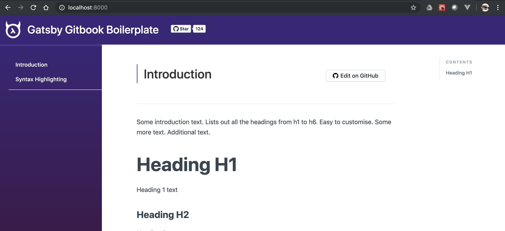
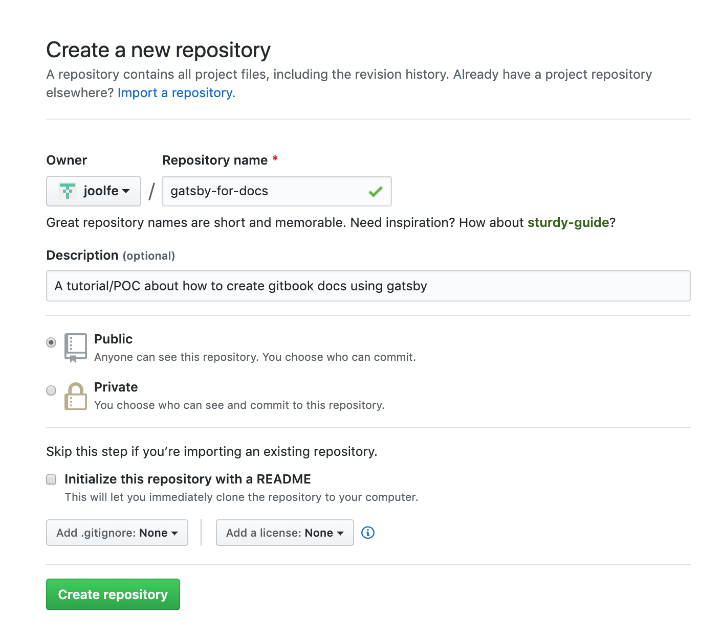
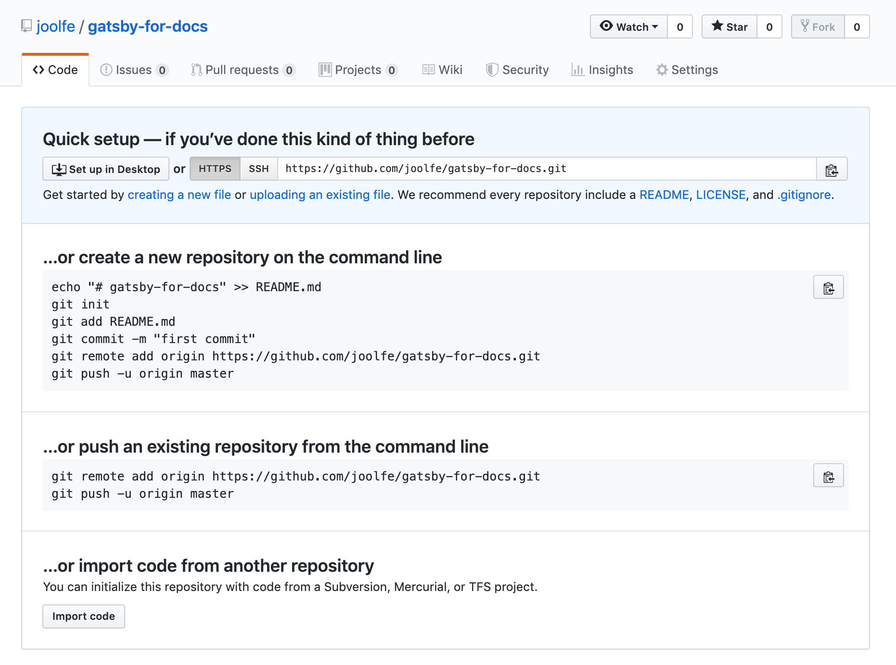

# Create a new gatsby project

The best way to create a new project in gatsby is using [starters](https://www.gatsbyjs.org/tutorial/part-zero/#create-a-gatsby-site), basically is a project template/skeleton from github with everything allready setup to start coding, sounds greate isn't it?

Our idea is to create a tutorial and i love the [gitbook](https://www.gitbook.com/) style for this kind of static docs, so we are going to use as 'starter' this project [gatsby-gitbook-starter](https://www.gatsbyjs.org/starters/hasura/gatsby-gitbook-starter/) 

To create the new project again a terminal command is more than enougth, you just need to select the new project folder name and the starter git url using this command `gatsby new {folder_name} {starter_git_url}`

We are going to use this:

```
$ gatsby new gatsby-for-docs https://github.com/hasura/gatsby-gitbook-starter
```

In no time we will found a new folder created with lot of things on it:

```
$ cd gatsby-for-docs/
$ ls
Dockerfile		README.md		content			gatsby-config.js	node_modules		package.json
LICENSE			config.js		doc.md			gatsby-node.js		package-lock.json	src
```

Basically this is a clone of the repo, and a great start for us.

Before continue let us check that our new project is working, gatsby comes with a develop server for test purpose, to build our new site and run in local we execute :

```
$ gatsby develop
```

After some seconds in our terminal will appear:

```
...
You can now view gatsby-gitbook-boilerplate in the browser.

  http://localhost:8000/

View GraphiQL, an in-browser IDE, to explore your site's data and schema

  http://localhost:8000/___graphql

Note that the development build is not optimized.
To create a production build, use npm run build

info ℹ ｢wdm｣: 
info ℹ ｢wdm｣: Compiled successfully.
```

Let us check in our browser the url `http://localhost:8000/`

That's what i have found, Great! 🚀



# Setup Git repo

We have our new project running and we donñt want to lose our work... I know, I know we have just execute a couple of commands 😗but we have create a new project and don´t want to loose so let us setup our github repo.

We already has an account on github offrcourse so let us login into github and create a new repo like showed in this image



After click the `Create Repository` button we will see the next instructions in the screen that is showed



So we go to the terminal and inside our project folder we are going to first add the remote origin with this command 

```
$ git remote add origin https://github.com/joolfe/gatsby-for-docs.git
```

And then we sill do our first push

```
$ git push -u origin master
```

If we check again our repo we can see our files 😁.

> Maybe you prefer to use a tool like sourcetree for git, is a good idea 😉.