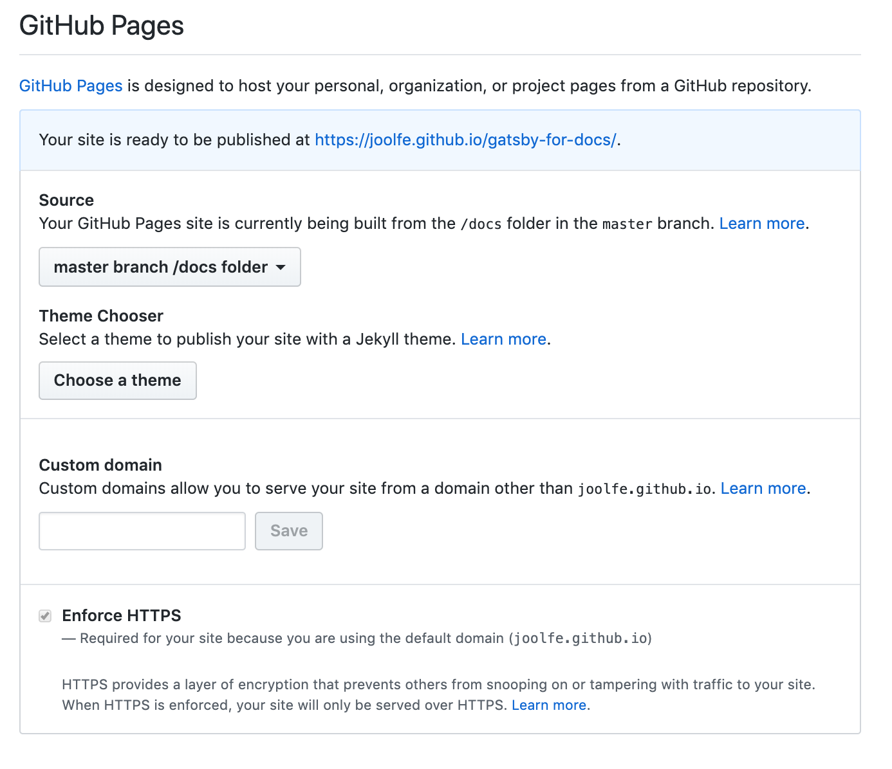
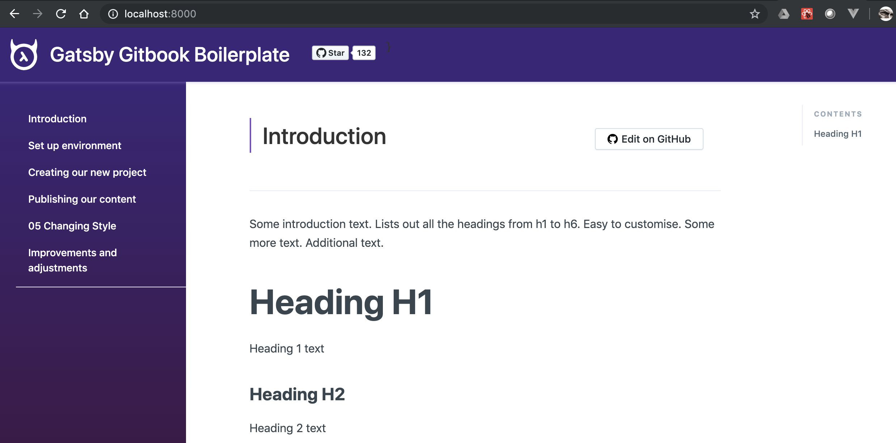

# Publish our first version

Our live/production server is going to be Github, using the [GitHub Pages](https://pages.github.com/) feature, why? well..it is free, work great and is the easiest option, can we wish more? 😙.

## Github set up

Before set up github need to create some folders and file sin our project, so:
   1. Create a `/docs` folder in our project root.
   2. Inside this folder create a `/docs/index.html` file.
   3. Inside this file put a simple html like `<h1>Hello GithubPages!!</h1>`

Ok we are now ready to activate github pages ✅, go to our recently created repo and navigate to "Settings" tab, in this page search for the "GitHub Pages" section and choose the /docs folder option in the combo.



Without do anything else we have publish a static page, just check in the url that appear in the blue panel, in our case [https://joolfe.github.io/gatsby-for-docs/](https://joolfe.github.io/gatsby-for-docs/) show this


We are online!! 🎉🎉🎉

## Creating content

Is time to start publishing our real content, one of the thing i loved from gitbook is how easy  is writte the docs in markdown, thats the reason why we are using [gatsby-gitbook-starter](https://www.gatsbyjs.org/starters/hasura/gatsby-gitbook-starter/) 😌.

So having a quick look into the starter documentation we see that all markdown content should be place in the folder `/content` and already inside this folder we have some examples.

```
$ ls
codeblock.md	index.mdx	introduction.md
```

We can remove it because we can have look in the git repo if we need to see something... and we already have some content to use (exactly what you are reading) so let us create some `.md` files, for example in the `01-introduction.md` file we will have:

```
---
title: "Introduction"
metaTitle: "Tutorial introduction"
metaDescription: "Why i have writte this tutorial?"
---

# Introduction

Welcome to the "gatsby-docs" tutorial, before start just let me explain the motivation to create this tutorial...

// file continue here...

```

> Offcourse is out of the scope of this tutorial to teach how to writte markdown 😅, if you need more info just have a look out there there are tons of tutorial about this.

And we continue adding files until we have something like this inside the `content` folder: 

```
$ ls
index.mdx
01-introduction.md
02-setup-environment.md
03-new-project.md		
04-publishing-content.md
05-changing-style.md
06-fixing-improving.md
```

We have name our file starting with the number of the chapter so while we are editing the files maintain the order.

Now we can test our content in local, so just execute:

```
$ gatsby develop
```
 But this time when we go to `http://localhost:8000/` we see an error screen

 

Oh no 😓!!

"Keep calm and carry on" we can see in the error message that is something related with `.concat(navItems.items)` and this seems to be the menu... ups! we have forget to add our new page to the menu and remove the old ones.

To do this open the `config.js` file that is on the root folder of our project, if you look for `sidebar` you will see this code:

```
"sidebar": {
  "forcedNavOrder": [
    "/introduction",
    "/codeblock"
  ],
```

Here we are choosing the order of the files in our documentation left menu and `codeblock.md` file not exist anymore, so to solve this we can leave this property with an empty array `[]` because we are already ordering the files with a number of the chapter so no need to "force the navigation order", in our file we will put this code:

```
"sidebar": {
  "forcedNavOrder": [],
  ... // the file continue here
```

if we run again the command:

```
$ gatsby develop
```
It's working now!  👏👏👏 



## Now publish our content

In local our static docs is working fine now is time to publish to the world 🌍!

Is going to be our firt deploy to `production` environment and while we have been testing in local our site in the terminal when we execute the command `$ gatsby develop` we can see a message at the end of the process that say "To create a production build, use npm run build" that's because normally when you are tetsing and debuging in develop you prefer to compile fast and to have a hot reload server.. but for production you want your sources minimified and everything more compact.

So let us try the command `$ npm run build` after a little more time than when we use the develop command we get:

```
info Done building in 31.865 sec
```
Great our static doc is ready for deployment.

Should be as easy as `push`  ⬆️ content to the github but there are a consideration, gatsby by default generate the static sources in a folder called `/public` and we need to put everything inside our repo `/doc` folder. 

To avoid do this manually all times we build our project let us add a command in the npm scripts, if you open the `package.json` file and look for the script field you will see:

```
  "scripts": {
    "start": "gatsby develop",
    "build": "gatsby build --prefix-paths"
  },
```

We are going to add inside the `build` script a command to move the content of public folder to the doc folder as this `mv public/* docs/`

> I'm using MacOS 🍎for those using windows or other SO [see here](https://www.computerhope.com/issues/ch001476.htm)

So after build is going to copy everything into the doc folder, let us try  using again the command

```
$ npm run build
```

This time when process is finish if we go to the `/doc` directory we can see our recently created static content :-)

So time to publish in github we use:

```
$ git add --all 
$ git commit -m 'trying to publish'
$ git push
```

And if we navigate to `https://joolfe.github.io/gatsby-for-docs/` we can see that our page is there!! 🎉🎊


