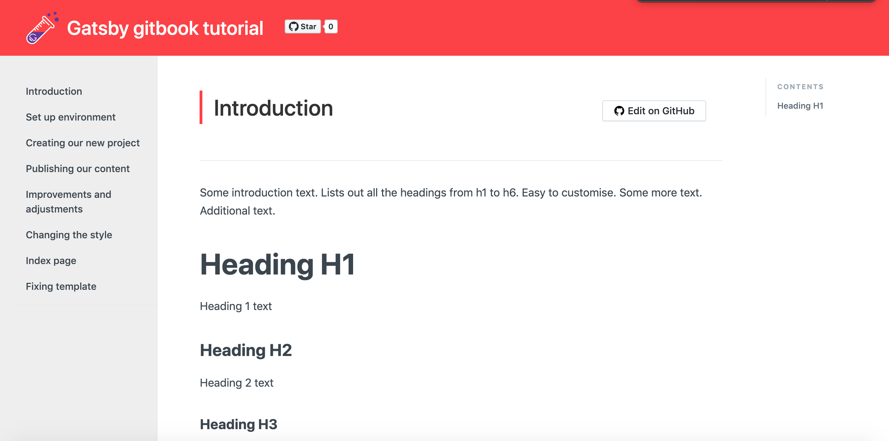

# Index page

You probabily have notice when firt enter in our wonderfull tutorial you see a incorrect introduction page



In our `01-introduction.md` file we have a  different content, this is because when we access to our tutorial page we are accesing to the `index.mdx` page, this pages comes from the starter that we are using.

here we have two options:
1. Put aditional information in this ´index.mdx´ file to show at the startup page of our tutorial.
2. Try to redirect the load of the tutorial to the `01-introduction.md` page.

I prefer the second one because we don't have much more to say in our first page 😗.

# Redirecting root path

So what we need is when somebody put in the browser **https://joolfe.github.io/gatsby-for-docs/** show instead the url **https://joolfe.github.io/gatsby-for-docs/01-introduction**.

After some minutes searching in google we get an example from the [gatsby github repo](https://github.com/gatsbyjs/gatsby/blob/master/examples/using-redirects/gatsby-node.js), and looks very easy, basically we need to add the redirection rules in `gatsby-node.js` file, in our case inside the we `exports.createPages` decalration we add this code:

```javascript
  const { createRedirect } = actions
  
  createRedirect({
    fromPath: `/`,
    isPermanent: true,
    redirectInBrowser: false,
    toPath: `/01-introduction`,
  })
```

To test we just execute `$ gatsby develop` and we can test in localhost that everything is working as expected, nice 💪!!
