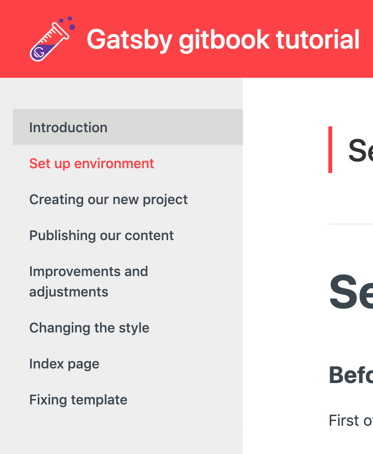

Even if the template we have choose is greate there are some errors in the code that we will fix next 

# The strange character in header

After change the styles, colors, logo... a strange character start appearing in the header, look the image:


You can see a character `}` at the end of the header 😣. 
Let us review the header code to see whats happen, for this we go to `src/components/Header.js` file and just having a look around the `GitHubButton` we see thare are a orphan `}` character 😑, we remove and thats all!

If we review the original github template (or starter) in the demo we can also see this error


So is nothing related with our changes 😜, we probabily can do a merge request to fix this in the original repo but this is not part of this tutorial...

# Right menu navigation

If try to use **right side menu bar** links to navigate inside a page, we notice that don't work 😰, for example testing in local in our page `http://localhost:8000/05-fixing-improving` when click on the **Google analytics** link we can see that url changes for `http://localhost:8000/05-fixing-improving#Google%20analytics` but the scroll don't change... Is easy to imaging that spaces translated to HTML as `%20` are the problem.

This kind of links are also known as **Bookmarks**, you can read more about this [here](https://www.w3schools.com/html/html_links.asp), and seems to don't accept spaces so to solve this we are going to change spaces for underscores like `_`.

We need to change in two places:

- In Nav bar: File `src/components/rightSidebar.js`, to make links point to anchor with underscores.
- In Headers: File `src/components/mdxComponents/`, the id should be the same as the link.

For both we are going to use the method `.replace(/\s+/g,"_")` to replace spaces for underscores.

Again this error is not related with our changes, maybe another merge request here?

# Menu size

After use the web we can see that left side menu change the size depending of the content of the page, have a look to this images:




After review css code we see that is a template issue again (not our error 😜), is trying to use [FlexBox](https://www.w3schools.com/css/css3_flexbox.asp) feature but not with too sucess...

We need to change the `flex` values in the layout items (left nav ba, main content and right nav bar) to fix this issue. 

The `flex` css property is a shorthand property for the `flex-grow`, `flex-shrink`, and `flex-basis`, and 
using google DevTools we can play with this values to see what is the best for our case.

After some testing we have decide to put:

- Left navbar: `flex: 1 0 18%`
- Main content: `flex: 1 0 68%`
- Rigth navbar: `flex: 1 0 14%`

We need to add this changes in the file `src/components/layout.js`, the layout is code looks like:

```jsx
const Layout = ({ children, location }) => (
  <ThemeProvider location={location}>
    <MDXProvider components={mdxComponents}>
      <Wrapper>
        <LeftSideBarWidth className={'hidden-xs'}>
          <Sidebar location={location} />
        </LeftSideBarWidth>
        <Content>
          <MaxWidth>{children}</MaxWidth>
        </Content>
        <RightSideBarWidth className={'hidden-xs'}>
          <RightSidebar location={location} />
        </RightSideBarWidth>
      </Wrapper>
    </MDXProvider>
  </ThemeProvider>
);
```

And we can find above in this file the definition of `LeftSideBarWidth`, `Content` and `RightSideBarWidth` here is where we need to put our css and our layout will work like a charm! ✨

# Code blocks

Another strange behaviour in our template is sintax higligth in the code blocks, for exmaple look the next picture:


In our markdown file we have indicate the language in the code block using the sintax `´´´bash`, but don't have too much sense that words **new** and **for** are in blue... seems like code block is higlight as java or javascript code even if we have indicate the language 😞.

Let us have look to the code, is easy to find that file `src/components/mdxComponents/codeBlocks.js` is our candidate and after a quick review we see that our starter is using [prism](https://prismjs.com/), a well known syntax highlighter component, more concretely what is being used is a react render component, see the import sentence:

```js
    import Highlight, { defaultProps } from "prism-react-renderer";
```

And we cannot forget that at the top of that the template is using a mdx parser for get the markdown and generate the static content, after a few searchs in google we found this [page](https://mdxjs.com/guides/syntax-highlighting/), seems to be exactly what our gatsby starter is doing, and comparing the code we can see the probelm:

```jsx    
    <Highlight
        {...defaultProps}
        code={exampleCode}
        language="javascript"
        theme={prismTheme}
        >
```

In `Highlight` component the language parameter is hardcode to **"javascrpit"**, thats the problem 😏. Just reading a little more the [mdx docs](https://mdxjs.com/guides/syntax-highlighting/) we see a solution, we need to get the language from the `className` using `const language = className.replace(/language-/, '')`.

After some test we have see that `className` is not directly in the method, is a value inside the object `props[]` and also sometimes the value is not present so we have create a conditional definition to use **"javascrpit"** when className is not defined, so the code finally looks like:

```jsx
const language = props["className"] ? props["className"].replace(/language-/, '') : "javascript";
    return (
      <Highlight
        {...defaultProps}
        code={exampleCode}
        language={language}
        theme={prismTheme}
      >
```

Another fixed issue, great job!


